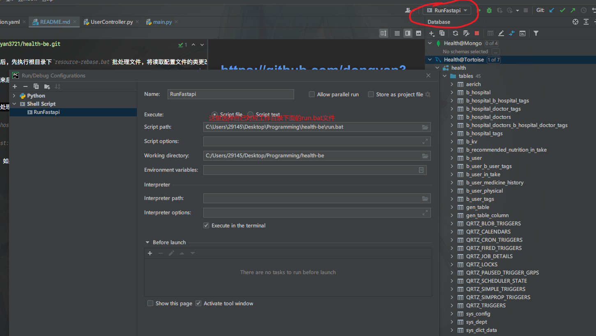

# https://github.com/dongyan3721/health-be.git
## **使用必读**
**特别重要！！** 项目拉取后，先执行根目录下`resource-rebase.bat`批处理文件，将读取配置文件的类更改为自己的路径。需要先安装git并且配置好对应的环境变量~

**特别重要！！！** 拉取下来后看`setup-dependencied.sh`那个文件里面的包大家都装了没，要是没装的话就在命令行里跑一下~
## Fastapi应用启动方法

项目根目录下有`run.bat`批处理文件，把这个文件添加到Pycharm的项目环境配置里面，每次启动他就行了

启动后，输入`http://localhost:(设定的端口号)/docs`进入接口阅读调试模式

也可以输入`http://localhost:(设定的端口号)/redoc`仅进入接口阅读模式

我这里设定的端口是`8080`，如果有冲突大家自行更换